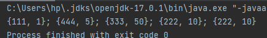
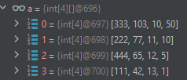

Задача было решена на языке Java

Все тесты которые даны проходить 

для решения задачи
1) сортировал матрицу по стоимости 

2) "задача" надо получить n(76) из pack'ов где самого первого высокий приоритет при этом надо учти остаток товаров
3) решил с помощью динамическим путем где n получал из предыдущих шагов ...
  