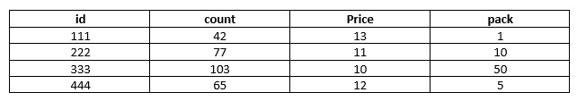
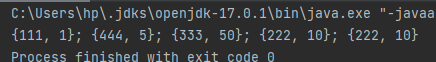
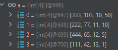

Задача было решена на языке Java

Все тесты которые даны проходить 

для решения задачи
1) сортировал матрицу по стоимости 

2) получить n(76) из pack где самого первого высокий приоритет при этом учел остаток
3) 
  